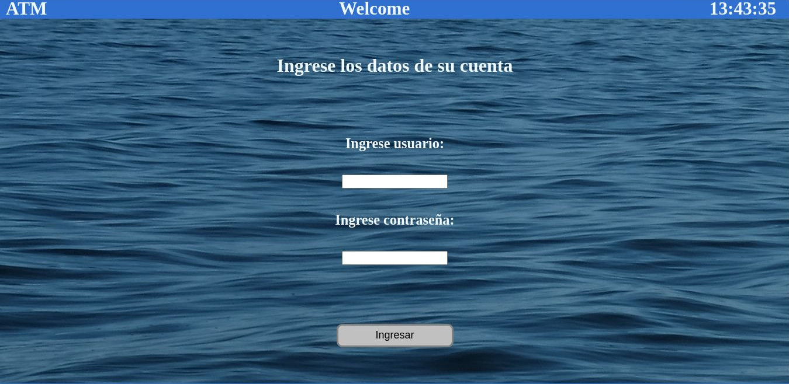
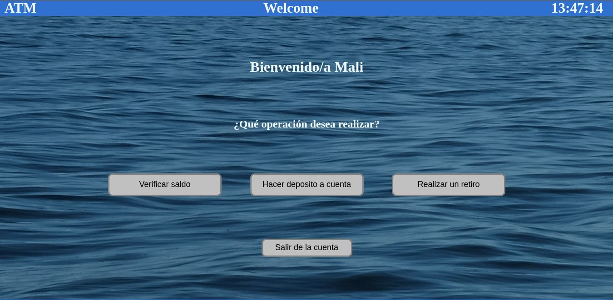

# Cajero automático

Esta página web simula un cajero automático con funciones simples tales como un sistema de login, hacer depósitos a cuenta, retiros y transferencias entre usuarios del banco.

## Tecnologías usadas

* HTML
* CSS
* JavaScript

## Usuarios almacenados para hacer login

Usuario | Contraseña
 ------ | ---------- 
Meli    | 1 
Gera    | 2 
Maui    | 3 

## Capturas de la aplicación web

* Login

* Menú principal

